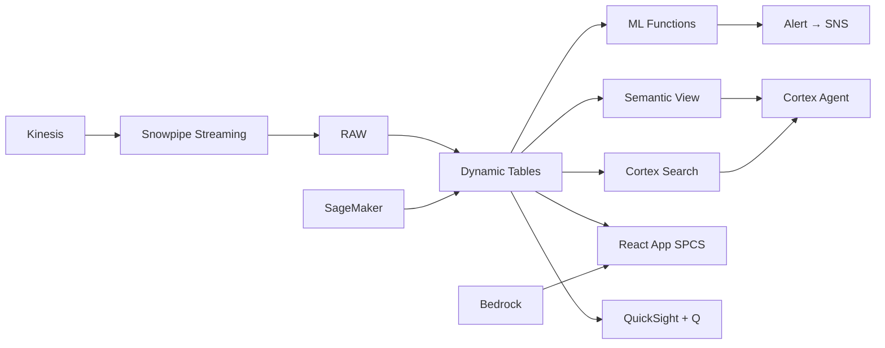

# Tourism Demand Forecasting

National tourism demand forecasting by source market — ML.FORECAST predicts arrivals from 20 source markets, enabling capacity planning, marketing spend allocation, and workforce scheduling across Thailand's tourism ecosystem.

## Architecture

Thailand targets 35 million tourists but planning is fragmented — TAT, hotels, airlines, and tour operators each forecast independently. ML.FORECAST unifies 146,000 data points across 100 market-destination pairs, detecting shifts 60-90 days early through leading indicators and enabling coordinated capacity planning.



## Snowflake Capabilities

| Capability | Implementation |
|-----------|---------------|
| Dynamic Tables | ARRIVAL_TIMESERIES / DEMAND_LEADING_INDICATORS / FORECAST_VS_ACTUAL / CAPACITY_UTILIZATION |
| ML Functions | ML.FORECAST + ML.ANOMALY_DETECTION |
| Cortex AI | COMPLETE, AI_CLASSIFY, AI_EXTRACT |
| Cortex Search | 20 documents indexed |
| Cortex Agent | TOURISM_DEMAND_AGENT |
| Semantic View | TOURISM_DEMAND_ANALYTICS |
| React App (SPCS) | 5 tabs + DemoGuide |


## AWS Services

| Service | Role in Demo |
|---------|-------------|
| Amazon SageMaker | Tourism demand forecasting models by source market |
| Amazon Kinesis | Stream real-time search and booking signals |
| Amazon Bedrock (Claude) | Generate market intelligence briefs and strategic narratives |
| Amazon EventBridge | Schedule forecast refresh and brief generation |
| Amazon SNS | Alert planning team on demand surges and forecast misses |
| Amazon QuickSight + Q | Demand forecasting dashboard with Snowflake Intelligence |


## Personas

| Persona | Role | Key Questions |
|---------|------|---------------|
| **Dr. Arunee Treevichit** | Chief Strategy Officer (Tourism Group) | "What's our 90-day arrival forecast by source market?" "Which markets are recovering faster than expected?" |
| **Thanakorn Petchnoi** | Demand Planning Analyst | "What's the forecast accuracy for Chinese market last quarter?" "Show me the seasonality pattern for European arrivals." |


## Data

| Table | Rows | Description |
|-------|------|-------------|
| ARRIVAL_HISTORY | 146,000 | Daily arrivals by source market and destination (20 markets × 5 destinations × ~1460 days) |
| FLIGHT_SCHEDULES | 25,000 | Inbound flight capacity by route and airline |
| VISA_APPLICATIONS | 80,000 | Visa application volumes as leading demand indicator |
| SEARCH_TRENDS | 300,000 | Google Trends and OTA search data for Thailand destinations |
| EVENT_CALENDAR | 500 | Thai festivals, events, and public holidays |
| MACRO_INDICATORS | 960 | Source market economic indicators (GDP, exchange rate, CPI) |
| HOTEL_CAPACITY | 2,500 | Hotel room supply by destination |
| THAI_TOURISM_POLICY | 20 | Visa policy changes, bilateral agreements, promotion campaigns |


## Build Instructions

### Prerequisites
- Snowflake account with ACCOUNTADMIN access
- Cortex AI enabled (ML Functions, Search, Agent)
- Warehouse: DEMAND_WH (Medium)
- AWS CLI with access (us-west-2)

### Deployment

```bash
snowsql -f snowflake/00_setup.sql
snowsql -f snowflake/01_marketplace_install.sql
snowsql -f snowflake/02_raw_tables.sql
snowsql -f snowflake/03_staging.sql
snowsql -f snowflake/04_dynamic_tables.sql
snowsql -f snowflake/05_search.sql
snowsql -f snowflake/06_ml_models.sql
snowsql -f snowflake/07_semantic_view.sql
snowsql -f snowflake/08_agent.sql
```

### React App (SPCS)
```bash
cd app && npm ci && npm run build
docker build -t aws-thailand-tourism-demand-forecast-app .
docker push bdiqc8sm-default.registry.snowflakecomputing.com/tourism_demand/app/aws_thailand_tourism_demand_forecast/app:latest
```

### Demo Mode
Open the app URL with `?demo=true` for presenter view.

## Build Modes

### Snowflake Only
Run scripts 00-08 (skip AWS-specific integration). Uses:
- **ML.FORECAST (native)** instead of Amazon SageMaker
- **Snowpipe Streaming SDK** instead of Amazon Kinesis
- **Cortex Complete** instead of Amazon Bedrock (Claude)
- **Tasks (CRON scheduling)** instead of Amazon EventBridge
- **Alerts + Notification Integration** instead of Amazon SNS
- **Snowflake Intelligence (Cortex Analyst)** instead of Amazon QuickSight + Q

### Full AWS + Snowflake
Run all scripts including AWS integration. Deploy QuickSight dashboard from `quicksight/`.

## Business Impact

Industry research and Snowflake customer outcomes:
- **Thailand tourism contributes ฿2.4 trillion to GDP (18% of national economy) supporting 8M jobs** — [NESDC Thailand](https://www.nesdc.go.th/main.php?filename=index_en)
- **ML-powered demand forecasting improves accuracy by 20-30% vs traditional time-series methods** — [McKinsey Travel](https://www.mckinsey.com/industries/travel-logistics-and-infrastructure/our-insights)
- **Thailand's visa-free policy for Chinese tourists increased arrivals by 45% within 3 months** — [TAT Thailand](https://www.tat.or.th/en)
- **Accurate demand forecasting enables 10-15% better capacity utilization and revenue capture** — [WTTC](https://wttc.org/research)


## Key Demo Numbers

- **35M arrivals** forecast for Thailand this year (12% YoY growth)
- **100 forecasts** market-destination pairs updated daily (ML.FORECAST)
- **67% recovery** Chinese market vs 2019 baseline
- **140% of 2019** Indian market exceeding pre-COVID levels
- **60-90 days** leading indicator early warning window
- **95% utilization** Phuket peak season hotel capacity forecast


## License

Apache 2.0 — See [LICENSE](LICENSE) for details.

This is a personal demo project and is not an official Snowflake offering. It comes with no support or warranty.